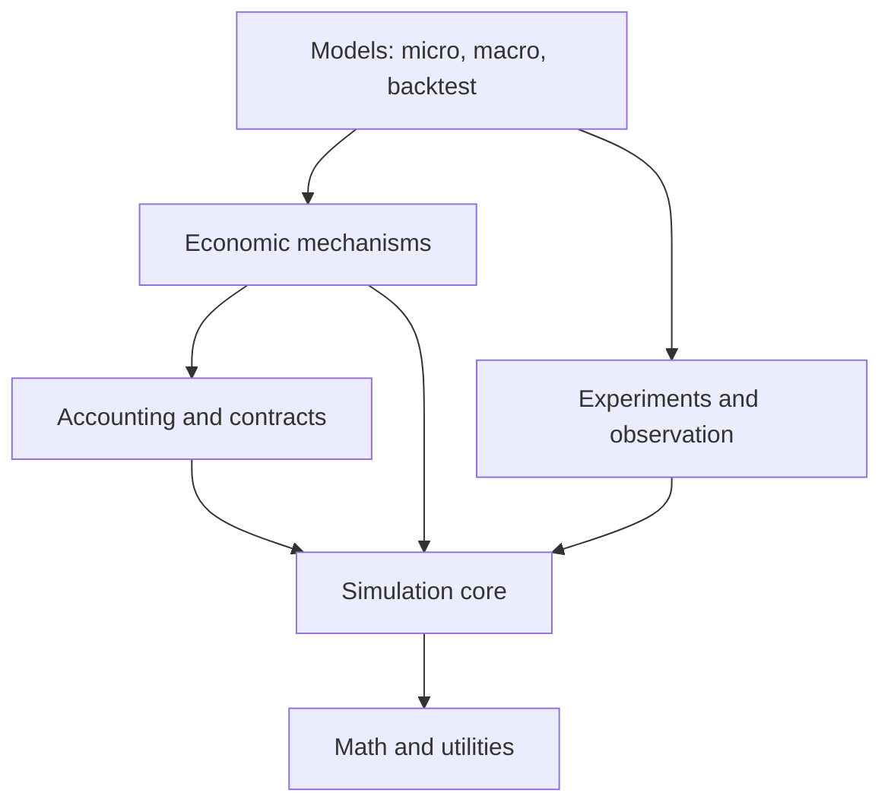

# economies.zig: roadmap to the de facto economic simulation library for Zig

Status: active implementation; code and release-gate ledger in `economies.zig/docs/ROADMAP_STATUS.md`  
Target compiler: Zig 0.16.0  
Project name: `economies.zig`  
Zig package and root import: `.economies` and `@import("economies")`  
MVP horizon: 32 weeks with three core maintainers  
MVP definition: credible macroeconomic, microeconomic, and event-driven backtesting model suites built on one deterministic simulation and accounting foundation

## Executive decision

We should build `economies.zig` as a **deterministic economic modeling toolkit**, not as an all-purpose agent framework and not as a direct Zig port of C++ ESL.

The package will provide five things exceptionally well:

1. Reproducible simulation: explicit clocks, seeded random streams, deterministic event ordering, replayable runs, checkpoints, and experiment manifests.
2. Economic correctness: typed quantities, exact monetary ledgers, assets, contracts, transactions, settlement, sector balance sheets, and conservation checks.
3. Interchangeable mechanisms: agents and models can use Walrasian clearing, auctions, bilateral trade, or a limit order book without rewriting the simulation engine.
4. Validated model families: canonical microeconomic, macroeconomic, and backtesting models with published equations, expected equilibria, invariants, and regression fixtures.
5. Zig-native performance and ergonomics: no hidden allocation, no global state, conventional `build.zig` integration, useful zero-dependency defaults, and data-oriented execution where scale requires it.

C++ ESL is valuable content precedent. It covers economic agents, identifiers, quantities and fixed-precision prices, financial instruments, messaging, parallel models, Walrasian clearing, limit order books, auctions, trading posts, and analysis/calibration. It also tries to make mechanisms swappable through a common messaging framework. Those are the right problem areas. We should not copy its C++ object hierarchy, Boost/MPI dependency model, or Python-first architecture. [C++ ESL repository and feature overview](https://github.com/INET-Complexity/ESL)

## What “de facto” means

Feature count will not make the package the default. The package becomes the default when a Zig developer can trust it faster than they can justify writing their own.

We will measure that position through six adoption outcomes:

| Outcome | Evidence |
| --- | --- |
| First useful model in under 30 minutes | Installation plus tutorial produces a running model and CSV output. |
| Results are defensible | Every reference model documents equations, assumptions, invariants, citations, and validation results. |
| Performance is legible | Reproducible benchmarks publish throughput, memory, target, compiler, and model configuration. |
| Extension is predictable | Adding an agent, market, strategy, observer, or solver does not require editing core internals. |
| Releases are dependable | Zig compatibility, package identity, migration notes, and immutable tags follow our 0.16 maintainer rules. |
| Researchers can cite and reproduce it | Releases include citation metadata, deterministic seeds, configuration manifests, and archived benchmark/model outputs. |

The MVP does not need to dominate Python economics on notebooks or C++ on distributed clusters. It must establish that Zig is unusually good for exact, reproducible, high-performance economic simulation.

## Product boundaries

### MVP includes

- A deterministic discrete-time and discrete-event simulation kernel.
- Typed entity IDs, clocks, events, random streams, observations, checkpoints, and run manifests.
- Exact monetary accounting plus floating-point model mathematics.
- Agents, goods, currencies, assets, contracts, orders, trades, portfolios, and sector ledgers.
- Walrasian clearing, standard auctions, bilateral/trading-post exchange, and a price-time-priority limit order book.
- Canonical microeconomic reference models.
- Canonical macroeconomic and stock-flow-consistent reference models.
- Event-driven historical backtesting with bar, quote, and trade inputs.
- Fill, fee, spread, slippage, settlement, and corporate-action handling.
- Experiment grids, seeded replications, summary statistics, CSV input/output, and checkpoint/replay.
- Documentation, examples, benchmarks, and a cross-platform CI matrix.

### Deferred until after MVP

- Python, R, Julia, or WASM bindings.
- MPI or distributed simulation.
- GPU execution.
- A dataframe implementation.
- A GUI, notebook environment, hosted service, or data marketplace.
- Vendor-specific live market-data and brokerage adapters.
- Full DSGE estimation, automatic differentiation, Bayesian inference, or automatic calibration.
- General-equilibrium solvers for every model class.
- Network economics, matching markets, coalition formation, mechanism-design solvers, and digital-twin synchronization as polished subsystems.

These deferred capabilities remain architectural tests. The MVP must not make them impossible, but we will not delay a strong core to ship shallow versions of them.

## Architecture

### One package, layered modules

The MVP should remain one package with a stable root import and cohesive submodules. Splitting packages too early would create version coordination and adoption friction.

```text
economies
├── core          IDs, time, RNG streams, events, schedules, runner, replay
├── math          statistics, distributions, roots, optimization, interpolation
├── accounting    money, accounts, journals, ledgers, balance sheets
├── economics     goods, currencies, agents, firms, contracts, assets
├── markets       orders, auctions, clearing, order books, settlement
├── micro         preferences, production, games, equilibrium models
├── macro         growth, RBC, SFC, sectors, policy, macro ABM
├── backtest      data events, strategies, broker simulation, metrics
├── experiment    parameters, replications, sweeps, calibration hooks
└── io            CSV, schemas, snapshots, run manifests
```

The compile-time dependency direction is downward:



`micro`, `macro`, and `backtest` may share lower layers but must never import one another. This prevents the backtester from becoming the accidental core of the package and keeps academic models usable without financial-market baggage.

### Simulation model

Use a hybrid data-oriented design:

- A `Simulation` owns time, the event queue, deterministic ordering, run state, observers, and cancellation.
- A model owns its domain state. The core does not require a universal base-agent type.
- Homogeneous populations use structure-of-arrays storage and batch systems.
- Small heterogeneous populations may use tagged unions or explicit behavior tables.
- Events are model-specific tagged unions routed through a generic scheduler.
- Stable entity IDs are values, never pointers or collection indices.
- Observers receive immutable views or copied events; observation cannot mutate model state.
- Parallel execution is deferred until the single-threaded semantics and replay contract are frozen.

Avoid a runtime inheritance framework. Zig models should satisfy small compile-time contracts such as `init`, `step` or `handle`, `observe`, `checkpoint`, and `deinit`. We should prototype two interfaces during Phase 1, benchmark both, and freeze the public model contract only after three vertical slices use it.

### Determinism contract

Reproducibility is a feature, not a debugging accident.

- Every run has a root seed.
- Every agent/system obtains a named or indexed child random stream; no global PRNG is exposed.
- Same-time events use an explicit stable tie-breaker.
- Hash-map iteration order never determines economic outcomes.
- Parallel work, when introduced, commits results in a deterministic order.
- Run manifests record package version, Zig version, target, optimization mode, seed, model name, parameters, input hashes, and output schema version.
- Checkpoint plus remaining input must reproduce the same event and ledger sequence.
- Exact replay is required for discrete state and ledgers on one target. Cross-target floating-point outputs use documented numerical tolerances.

### Numeric policy

No one numeric type is correct for all economics.

- Monetary ledgers use exact fixed-point minor units backed by a checked signed integer.
- Security quantities use checked integer lots by default.
- Prices at exchanges use integer ticks or an exact quote ratio.
- Rates, utilities, production functions, regressions, equilibria, and continuous state use generic floating-point types with `f64` defaults.
- Conversion between exact accounting values and approximate model values is explicit and fallible.
- Overflow, invalid currency conversion, inconsistent units, and unbalanced journal entries are errors.

This takes the strongest idea visible in ESL's order-book example, fixed-precision prices, and makes the exact/approximate boundary part of the public design. [ESL order-book example](https://github.com/INET-Complexity/ESL#examples)

## MVP capability matrix

### Core and economic primitives

| Capability | MVP deliverable | Acceptance test |
| --- | --- | --- |
| Time | Integer ticks plus ordered event timestamps | Stable order under equal timestamps and replay. |
| Randomness | Root seed and independently derivable streams | Reordering unrelated agents does not alter another stream. |
| Events | Allocator-aware priority queue and typed payloads | Cancellation, rescheduling, tie-breaking, and checkpoint tests. |
| Accounting | Double-entry journals and multi-sector balance sheets | Every accepted transaction balances; aggregate net financial assets reconcile. |
| Units | Currency, amount, price, quantity, rate, asset ID | Invalid mixing fails at compile time or returns a typed error. |
| Contracts | Cash flows, maturity, counterparties, settlement | Lifecycle and default fixtures reconcile both counterparties. |
| Observation | Metrics, event log, state snapshots, CSV | Observer cannot affect model outcome; schemas are versioned. |
| Experiments | Parameter grids and seeded replications | Same manifest produces same ordered result set. |

### Microeconomic models

The MVP micro suite must demonstrate optimization, equilibrium, strategic interaction, and decentralized exchange.

1. **Consumer/producer partial equilibrium**
   - Cobb-Douglas and CES utility.
   - Budget constraints, Marshallian demand, simple production and cost functions.
   - Competitive single-market equilibrium via excess-demand root finding.
   - Validation: closed-form Cobb-Douglas demand and market-clearing residual.

2. **Multi-good Walrasian exchange**
   - Heterogeneous endowments and preferences.
   - Tâtonnement plus a numerical clearing solver.
   - Validation: budget feasibility, Walras' law within tolerance, zero aggregate excess demand, known two-agent fixtures.

3. **Oligopoly and games**
   - Cournot quantity and Bertrand price competition.
   - Normal-form payoff representation, best responses, pure Nash enumeration, and replicator dynamics.
   - Validation: closed-form symmetric equilibria and payoff invariants.

4. **Auctions and trading posts**
   - First-price sealed-bid, second-price, English, Dutch, and double auction mechanisms.
   - Bilateral exchange and a Shapley-Shubik-style trading-post example.
   - Validation: allocation/payment fixtures, conservation, deterministic tie resolution, and second-price incentive examples.

5. **Continuous double auction**
   - Price-time-priority limit order book.
   - Market, limit, cancel, replace, immediate-or-cancel, and good-until-cancelled orders.
   - Partial fills, trades, fees, and settlement.
   - Validation: never-crossed resting book, price/time priority, asset and cash conservation, and differential tests against a slow reference matcher.

ESL likewise treats Walrasian clearing, multiple order-book implementations, auctions, and trading posts as interchangeable market mechanisms. Our MVP narrows each mechanism to one well-tested implementation before adding performance-specialized variants. [ESL market mechanisms](https://github.com/INET-Complexity/ESL#market-mechanisms)

### Macroeconomic models

The MVP macro suite must cover analytical dynamics, numerical dynamic optimization, accounting-consistent sector models, and emergent agent behavior.

1. **Solow-Swan growth model**
   - Capital accumulation, depreciation, population and technology growth, savings policy, transition paths, and comparative statics.
   - Validation: analytical steady state and convergence fixtures.

2. **One-sector real business cycle model**
   - Representative household, competitive firm, capital accumulation, AR(1) productivity shock.
   - Value-function iteration for a bounded state grid, policy extraction, simulation, and impulse responses.
   - Validation: Bellman residual thresholds, monotone policy function, deterministic steady state, and reference impulse-response fixtures.

3. **Stock-flow-consistent sector model**
   - Households, firms, commercial bank, government, and central bank.
   - Transaction-flow matrix, sector balance sheets, deposits, loans, bonds, taxes, spending, interest, and accounting closures.
   - Validation: every row/column accounting identity, flow-to-stock reconciliation, and known steady-state/scenario fixtures.

4. **Minimal heterogeneous-agent macro model**
   - Many households with income/employment state, firms with adaptive production and pricing, a labor market, consumption-goods market, bank credit, fiscal policy, and central-bank rate rule.
   - Purpose: integrate the event engine, markets, contracts, ledgers, and observers into one economy.
   - Validation: exact nominal conservation identities, reproducible distributions, no impossible balance sheets, and documented stylized-fact ranges rather than claims of empirical truth.

The heterogeneous model is the MVP showcase, but it comes last. It must be assembled from already validated mechanisms. Starting with a giant “economy” would bury errors in emergent behavior and make validation impossible.

### Backtesting models

Backtesting is a simulation domain, not a loop over price bars. The engine must model information arrival and execution separately.

1. **Point-in-time data stream**
   - In-memory and CSV sources for bars, quotes, trades, rates, dividends, splits, and symbol metadata.
   - A monotonic event clock and explicit exchange calendars.
   - No data becomes visible before its event timestamp.

2. **Strategy interface**
   - Immutable market/account views.
   - Order intents returned as values.
   - No direct portfolio mutation.
   - Deterministic strategy-specific random stream.

3. **Broker and exchange simulation**
   - Market/limit orders, latency, partial fills, spread, fees, slippage, rejects, cash checks, and settlement delay.
   - Bar-based fill model and quote/trade event fill model.
   - Explicitly labeled assumptions; bar data cannot pretend to reveal intrabar order sequence.

4. **Portfolio accounting**
   - Cash, positions, lots, realized/unrealized P&L, dividends, splits, fees, financing, and mark-to-market.
   - All performance results derive from the same double-entry ledger used elsewhere.

5. **Evaluation**
   - Equity and drawdown curves, return series, turnover, exposure, hit rate, profit factor, volatility, Sharpe and Sortino ratios, maximum drawdown, and trade ledger.
   - Train/test partitions, rolling and anchored walk-forward evaluation, parameter grids, and seeded Monte Carlo perturbations.
   - The report records data range, symbols, missing-data policy, cost model, fill model, and parameters.

6. **Reference strategies**
   - Buy-and-hold as an accounting baseline.
   - Moving-average crossover as a delayed-signal baseline.
   - Cross-sectional momentum as a multi-asset baseline.
   - Avellaneda-Stoikov-style market making as an order-book integration example after the LOB is stable.

Acceptance tests target common false confidence sources: look-ahead leakage, trades before signal availability, impossible bar fills, missing fees, split/dividend accounting errors, inconsistent P&L, and parameter selection on the test window.

The package can prevent temporal leakage and record assumptions. It cannot eliminate survivorship bias or bad vendor data without point-in-time datasets, so those limitations must be prominent in the API and documentation.

## Delivery plan

This schedule assumes three core maintainers:

- Simulation lead: kernel, storage, determinism, performance, checkpoints.
- Economics lead: accounting, mechanisms, micro/macro models, validation.
- Markets lead: order book, backtester, I/O, experiment runner.

All three share API review, documentation, tests, releases, and community work. A solo implementation should expect roughly 12–18 months for the same MVP rather than deleting validation work to meet the 32-week date.

### Phase 0: Charter and falsifiable design, weeks 1–2

Deliverables:

- Final package name, Apache-2.0 license recommendation, governance, contribution policy, and citation metadata.
- Zig 0.16.0 manifest, strict `.paths`, conventional modules, `test`, `examples`, `bench`, `docs`, and `all` steps.
- Architecture decision records for time, numeric policy, RNG, entity IDs, model interface, event ownership, and serialization.
- Model specifications with equations and validation fixtures before implementation.
- Benchmark protocol and reference hardware record.

Exit gate:

- The public contracts can express three paper designs: a Walrasian exchange, Solow growth, and moving-average backtest.
- No implementation begins for a mechanism lacking explicit invariants.

### Phase 1: Reproducible vertical slice, weeks 3–7

Build:

- IDs, clock, seeded RNG streams, event queue, runner, observers, run manifest, CSV output.
- A minimal exact-money type and double-entry journal.
- Checkpoint/restart for one model state.
- Three tiny vertical slices, one from each model family.

Exit gate:

- Same-seed runs reproduce event and ledger hashes.
- Different seeds produce documented statistical variation.
- The three examples run through the same public runner.
- Debug and ReleaseSafe pass on Linux, macOS, and Windows.

### Phase 2: Economic kernel, weeks 6–11

Build:

- Currencies, amounts, prices, quantities, goods, assets, counterparties, contracts, accounts, portfolios, and settlement.
- Root finding, distributions, sampling statistics, interpolation, and bounded optimization needed by the first models.
- Typed observer schemas and invariant framework.

Exit gate:

- Cash and asset transfer, loan lifecycle, coupon/dividend, default, and settlement fixtures all reconcile.
- Exact values never silently convert to floating point.
- Allocation and error behavior are documented for every public operation.

### Phase 3: Microeconomic suite, weeks 9–16

Build in validation order:

1. Consumer/producer primitives and partial equilibrium.
2. Walrasian multi-good exchange.
3. Cournot, Bertrand, normal-form games, and replicator dynamics.
4. Standard auctions and bilateral/trading-post exchange.
5. Reference limit order book and then an optimized implementation.

Exit gate:

- All five model groups pass analytical, invariant, regression, and replay tests.
- Swapping the Walrasian mechanism for an auction in a supplied example changes mechanism configuration, not agent storage or the runner.
- Slow and optimized order books agree on randomized command traces.

### Phase 4: Macroeconomic suite, weeks 12–21

Build in validation order:

1. Solow-Swan.
2. RBC solver and impulse-response tooling.
3. SFC accounts and sector model.
4. Minimal heterogeneous-agent macro model assembled from prior components.

Exit gate:

- Solow analytical and simulated steady states agree within tolerance.
- RBC Bellman residual and policy monotonicity meet documented thresholds.
- SFC matrices balance at every simulated period.
- The macro ABM runs 100 seeded replications without violating ledgers, stock-flow constraints, or state validity.

### Phase 5: Backtesting suite, weeks 15–24

Build:

- Point-in-time data events, calendars, strategy interface, simulated broker, fills, fees, latency, settlement, portfolios, corporate actions, and reports.
- Reference strategies and synthetic datasets with known expected results.
- Walk-forward and parameter-sweep runner.
- Integration with the limit order book and experiment system.

Exit gate:

- No-look-ahead tests deliberately attempt and fail to access future data.
- Every trade, fee, cash flow, position, and P&L report reconciles to the ledger.
- Buy-and-hold matches a hand-calculated fixture including dividends and splits.
- Increasing nonnegative costs never improves a fixed execution path's terminal wealth.

### Phase 6: Experiments, calibration hooks, and performance, weeks 22–27

Build:

- Deterministic replications, parameter grids, streaming aggregates, confidence intervals, and result schemas.
- Calibration interface without committing to one optimizer.
- Checkpoint/replay across the model suites.
- Data-oriented batch APIs and profiled hot-path optimizations.

Exit gate:

- A failed 1,000-run sweep can resume without recomputing completed runs.
- Results are identical whether replications are requested serially or through the future parallel execution abstraction.
- Benchmark improvements include before/after profiles and never weaken invariants.

### Phase 7: MVP hardening and public release, weeks 28–32

Deliver:

- Complete API documentation, a conceptual guide, three getting-started tutorials, model cookbook, validation reports, and performance reports.
- Fresh-cache installation tests using `zig fetch --save`.
- Release archives, changelog, migration policy, security policy, citation file, immutable `v0.1.0` tag, and an explicit Zig 0.16 compatibility statement.
- At least nine polished examples: three micro, three macro, three backtest.
- Independent reproduction by two users who did not implement the library.

MVP release gate:

- Every capability marked MVP exists behind a documented public API.
- All reference models reproduce their stated expected results.
- CI passes exact Zig 0.16.0 on every claimed platform.
- No open correctness defect in accounting, event ordering, data timing, settlement, or model validation.
- Package contents contain only intended source, docs, examples, license, and build files.

## Testing strategy

### Four layers of proof

1. **Unit tests**: arithmetic, queues, matching, journal entries, solvers, metrics.
2. **Property tests**: conservation, balance, monotonicity, deterministic replay, valid state transitions.
3. **Reference tests**: analytical equilibria, paper equations, hand-calculated ledgers, known impulse responses.
4. **Differential tests**: optimized implementation versus intentionally slow reference implementation.

### Required invariants

- Money is neither created nor destroyed except by an explicitly modeled issuer operation.
- Every journal entry balances by currency.
- Every security movement has matching debit/credit ownership changes.
- No fill exceeds open quantity or available liquidity under the selected model.
- No backtest decision observes a future event.
- Event time never moves backward.
- A checkpoint restores model, scheduler, RNG, observer schema, and accounting state.
- Observer presence or order cannot affect economic results.
- Every randomized failure prints a seed and minimal replay manifest.

Fuzz the order book, event queue, parsers, serializers, journal construction, and checkpoint decoder from the first release. C++ ESL's test inventory shows the breadth required around agents, identifiers, environments, exchange, order books, quantities, parallel models, and Walrasian markets; our tests should be equally domain-specific rather than relying on a few end-to-end simulations. [ESL test inventory](https://github.com/INET-Complexity/ESL/tree/master/test)

## Performance plan

Correctness comes first, but a simulation library without a performance model will eventually calcify.

Publish benchmarks for:

- Event enqueue/dequeue and dispatch.
- RNG generation and stream derivation.
- Ledger transaction throughput.
- Order insert/cancel/match throughput at multiple book depths.
- Homogeneous agent updates per second and bytes per minimal agent.
- Solow/RBC/SFC simulation time.
- Backtest events per second for bars and quote/trade streams.
- Experiment throughput and peak memory.

Rules:

- Benchmark Debug, ReleaseSafe, and ReleaseFast separately.
- Record CPU, OS, Zig version, target, allocator, seed, configuration, and data size.
- Do not hide setup or I/O costs; publish separated and end-to-end figures.
- Add performance budgets only after the Phase 1 baseline exists.
- Require a profile for optimization PRs.
- Preserve a simple reference implementation for differential testing even after optimizing.

Parallel execution comes after deterministic serial semantics. The first parallel target is independent replications and parameter sweeps, followed by deterministic batch systems. Cross-agent event processing and distributed execution are post-MVP because they create much larger semantic and debugging costs.

## Documentation and adoption plan

### Documentation pyramid

1. Five-minute install and first model.
2. Concepts: time, state, events, agents, markets, accounting, observation, experiments.
3. Tutorials: micro equilibrium, SFC macro model, realistic backtest.
4. How-to guides: new mechanism, new agent, custom observer, custom fill model, checkpoint, parameter sweep.
5. API reference and ownership/error contracts.
6. Validation reports for every reference model.
7. Benchmark methodology and current results.

### Community mechanics

- Use small RFCs for public API and model-semantics changes.
- Maintain `good first model`, `good first mechanism`, and `validation needed` issue labels.
- Require equations, assumptions, tests, citations, and examples for model contributions.
- Publish a compatibility table mapping package tags to Zig releases.
- Keep main green on the supported stable compiler; test Zig master as informational until a migration branch opens.
- Establish a quarterly model review with at least one economics-domain reviewer and one systems reviewer.

The initial community pitch should be specific: “Build auditable economic simulations and backtests in Zig with exact accounting and deterministic replay.” Avoid promising every school of economics or claiming empirical validity from infrastructure alone.

## Post-MVP roadmap

### v0.2: Research workflow

- Parallel replications and deterministic worker pool.
- Calibration algorithms, approximate Bayesian computation hooks, sensitivity analysis, and uncertainty decomposition.
- Arrow/Parquet interoperability through optional packages.
- Richer visualization output schemas and notebook-friendly CLI processes.
- More macro models, heterogeneous-agent solution methods, and empirical moment libraries.

### v0.3: Strategic systems and digital twins

- Network economics and diffusion.
- Matching and bargaining mechanisms.
- Cooperative games, Shapley values, coalition analysis, and stability concepts.
- Mechanism-design primitives and auction-design experiments.
- Scenario graphs, interventions, policy constraints, and real-time state synchronization.
- A digital-twin adapter that maps observed entities and relationships into model state without coupling the core to any database.

This is the natural bridge to synchronized operational graphs, counterfactual simulation, Nash equilibrium, Pareto analysis, coalition behavior, and governed interventions. The lower layers built for economic simulation provide the typed relationships, accounting, contracts, events, and reproducibility that such digital twins need.

### v0.4: Ecosystem reach

- Stable C ABI for model execution and results.
- Python bindings focused on model configuration, parameter sweeps, and analysis rather than reimplementing the kernel.
- WASM target for teaching and interactive demonstrations.
- Optional live-market and brokerage adapters separated from the deterministic research core.
- Curated model registry with validation status and compatible package versions.

### v1.0: Stability contract

- Public interfaces stable across a declared compatibility window.
- Versioned snapshot and result schemas.
- Documented determinism guarantees by target and numeric mode.
- Long-term benchmark history.
- Independent published work using the package.
- Governance that can outlive the founding maintainers.

## Principal risks and controls

| Risk | Consequence | Control |
| --- | --- | --- |
| Building a universal agent abstraction | Slow APIs, allocations, inheritance-like complexity | Model-owned state, small compile-time contracts, SoA batch path. |
| Mixing exact accounting and floating math | Silent reconciliation drift | Explicit exact/approximate boundary and checked conversions. |
| Starting with a giant macro ABM | Unverifiable emergent bugs | Analytical and accounting models precede the integration ABM. |
| Backtesting becomes finance-only architecture | Macro/micro modules become awkward | Backtest is a peer model family over shared core/accounting/markets. |
| Premature parallelism | Nondeterminism and irreproducible bugs | Freeze serial semantics; parallelize independent replications first. |
| Too many mechanisms, none validated | Impressive list with low trust | One reference implementation and complete validation before variants. |
| Zig release churn | Broken consumers and maintainer fatigue | Compiler-specific tags, compatibility table, migration branch, exact CI pins. |
| Poor researcher ergonomics | Technically strong package with no adoption | Tutorials, CSV, manifests, examples, later Python/C ABI. |
| False empirical authority | Users mistake infrastructure for validated economics | Model cards state assumptions, calibration, limits, and validation status. |
| One-maintainer bottleneck | Project stalls before legitimacy | RFCs, contribution templates, model review, modular ownership. |

## Immediate next 30 days

Week 1:

- Decide the final package/repository name and Apache-2.0 license.
- Write the charter, contribution rules, compatibility policy, and model-card template.
- Create `build.zig`, `build.zig.zon`, CI, docs skeleton, and architecture-decision directory.
- Specify numeric policy, deterministic ordering, RNG streams, and entity IDs.

Week 2:

- Prototype two model interfaces against three tiny vertical slices.
- Write golden fixtures for a Cobb-Douglas market, Solow path, and buy-and-hold ledger.
- Implement the benchmark harness and run manifest schema.
- Hold the first API review and select the model interface.

Week 3:

- Implement the event queue, scheduler, observer boundary, exact money, journal, and CSV writer.
- Add same-seed replay and observer-noninterference tests.
- Publish the first design note and benchmark baseline.

Week 4:

- Complete all three vertical slices through the public runner.
- Run Debug and ReleaseSafe across the initial platform matrix.
- Cut `v0.0.1` as an architectural preview, explicitly without API stability.
- Recruit one external economist/modeler and one Zig maintainer for design review.

## Final MVP scorecard

The MVP is complete only if every answer is yes:

- Can a user implement a new model without editing the core?
- Can every run be replayed from a manifest and inputs?
- Do all monetary and asset flows reconcile?
- Are micro models validated against analytical or reference results?
- Are macro stocks and flows validated at every period?
- Does the backtester enforce point-in-time information and realistic execution assumptions?
- Do the three model families use the same core rather than three disguised engines?
- Are examples, docs, benchmarks, and validation artifacts tested in CI?
- Does a fresh Zig 0.16.0 consumer install the package with the standard package manager?
- Have independent users reproduced at least one model from each family?

If those conditions hold, `economies.zig` will already be more credible than most young simulation packages. The route to de facto status after that is disciplined expansion: more validated models, stronger research workflow, stable interoperability, and community ownership without weakening the accounting or determinism guarantees that distinguish the library.

## Reference points

- [C++ Economic Simulation Library](https://github.com/INET-Complexity/ESL): content precedent for agents, markets, high-performance economic models, analysis, calibration, and Python access.
- [ESL market mechanisms](https://github.com/INET-Complexity/ESL#market-mechanisms): Walrasian clearing, limit order books, auctions, and trading posts.
- [ESL examples](https://github.com/INET-Complexity/ESL/tree/master/example): Walrasian and order-book examples plus the Chiarella-Iori market model.
- [ESL tests](https://github.com/INET-Complexity/ESL/tree/master/test): domain-specific tests spanning agents, environments, exchange, order books, quantities, parallel models, and markets.
- [Zig 0.16.0 release notes](https://ziglang.org/download/0.16.0/release-notes.html): current build-system, test-timeout, package identity, and project-local dependency behavior.
- [Zig 0.16.0 language reference](https://ziglang.org/documentation/0.16.0/): language, testing, documentation, style, allocator, and I/O conventions.
- [Solow, “A Contribution to the Theory of Economic Growth” (1956)](https://academic.oup.com/qje/article-abstract/70/1/65/1903777): analytical growth-model reference and steady-state fixture basis.
- [Kydland and Prescott, “Time to Build and Aggregate Fluctuations” (1982)](https://www.jstor.org/stable/1913386): canonical real-business-cycle reference.
- [Godley and Lavoie stock-flow-consistent modeling resources](https://marc-lavoie.com/stock-flow-consistent-modelling): macro accounting and sector-model reference family.
- [Avellaneda and Stoikov, “High-frequency trading in a limit order book” (2008)](https://www.tandfonline.com/doi/abs/10.1080/14697680701381228): market-making integration example after the order book is validated.
